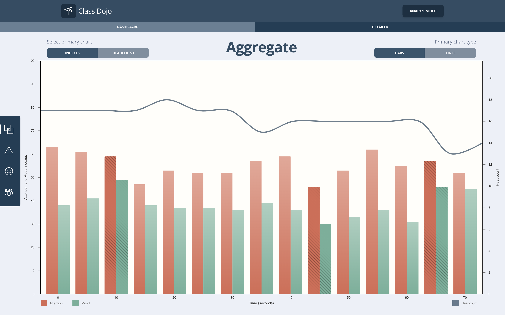

# Class Dojo - Frontend repository

This repo contains the frontend of Class Dojo. You can run it locally, it will use the mock API for returning data when you upload a video.

You can find the complete project [here](https://github.com/class-dojo)

And you can try the deployed app [here](www.classdojo.ninja)

## Using Class Dojo

### Run

```bash
docker-compose -f docker-compose.yml -f docker-compose.dev.yml up
````

Should not be run outside of docker container


### Upload a video


Simply select a video from your machine and choose analysis quality. Higher quality analysis will take longer.


### Dashboard


This screen displays the aggregate, attention and mood graphs in a compact and clear view. You can see it all with no need to scroll.

Click the share analysis button to copy a link to your analysis results, which you can store and share.

Chart mode can be toggled on all charts, and the aggregate chart allows for


### Detailed view



This screen displays your analysis in large chart format. High precision is the name of the game.


## Tech stack

- React with typescript
- Bootstrap for styling
- Ffmpeg wasm for extracting frames from videos
- NIVO for creating charts

